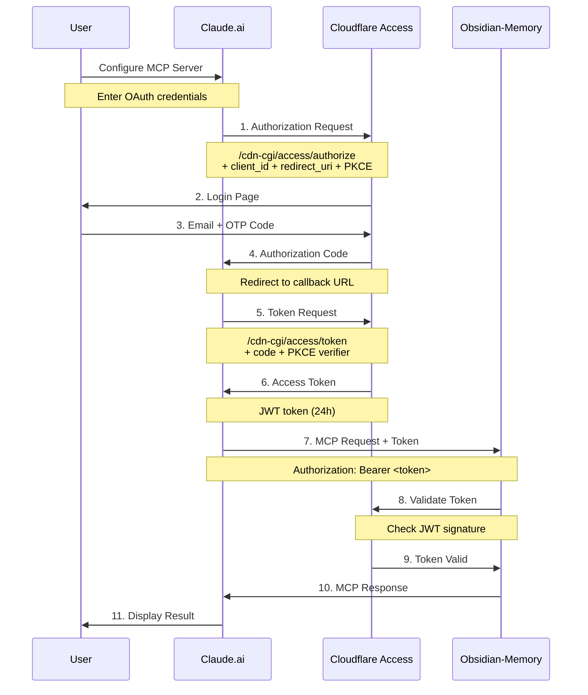
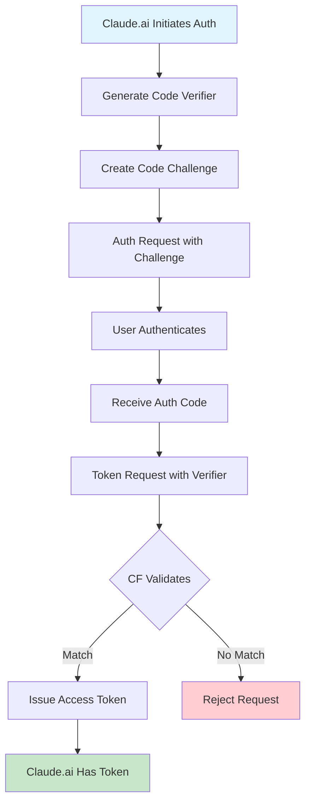
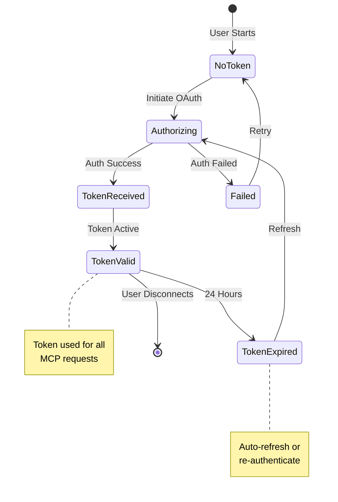
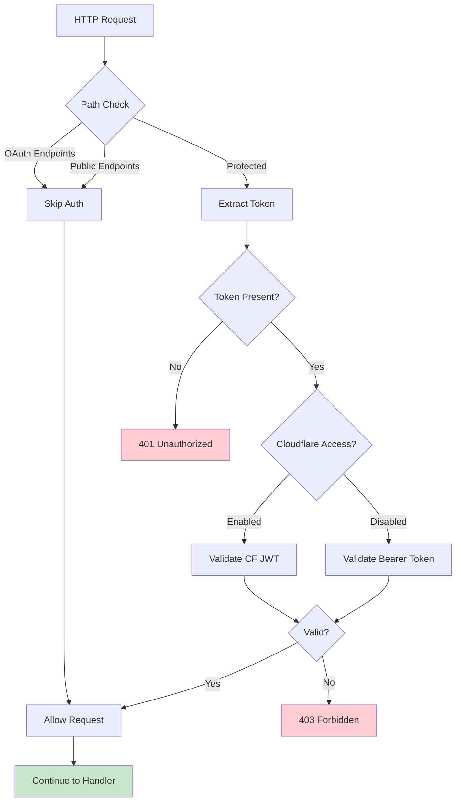
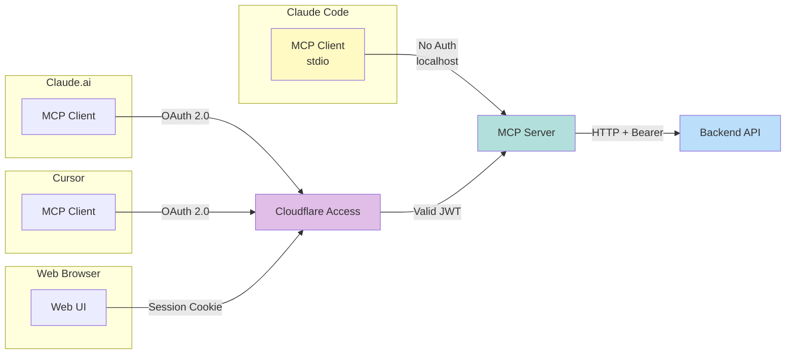
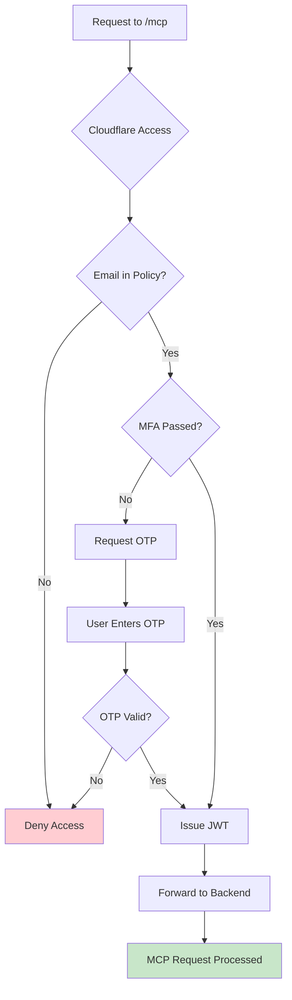
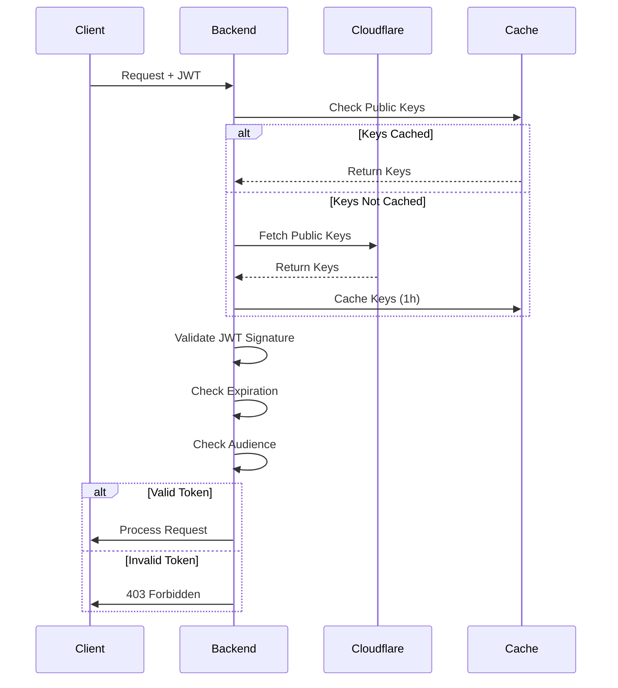
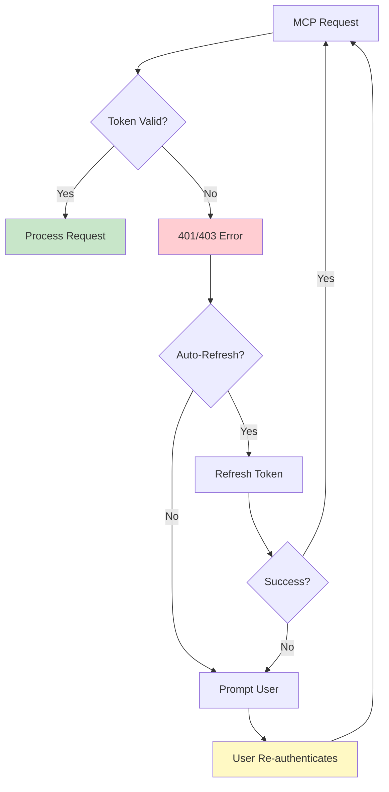

# OAuth 2.0 Flow Diagrams

Visual representation of OAuth authentication flows in Obsidian-Memory.

## Claude.ai OAuth Flow

## PKCE Flow Detail

## Token Lifecycle

## Authentication Middleware Flow

## Multi-Client Authentication

## Cloudflare Access Policy Evaluation

## Token Validation Process

## Error Recovery Flow

## Related Documentation

- [Claude.ai Integration Guide](../CLAUDE-AI-INTEGRATION.md)
- [Authentication Guide](../AUTHENTICATION.md)
- [MCP Integration](../mcp-integration.md)
- [Architecture Overview](../ARCHITECTURE.md)
