# System Architecture Diagrams

Visual representation of Obsidian-Memory system architecture and data flows.

## High-Level System Architecture

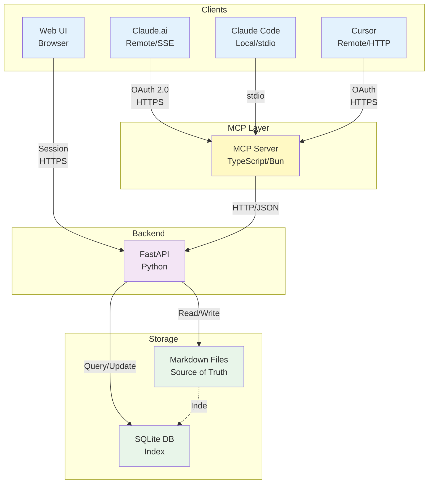

## MCP Server Architecture

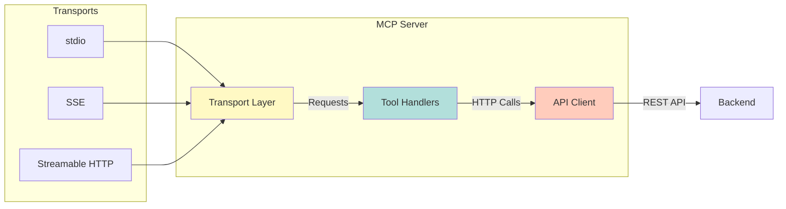

## Backend Architecture

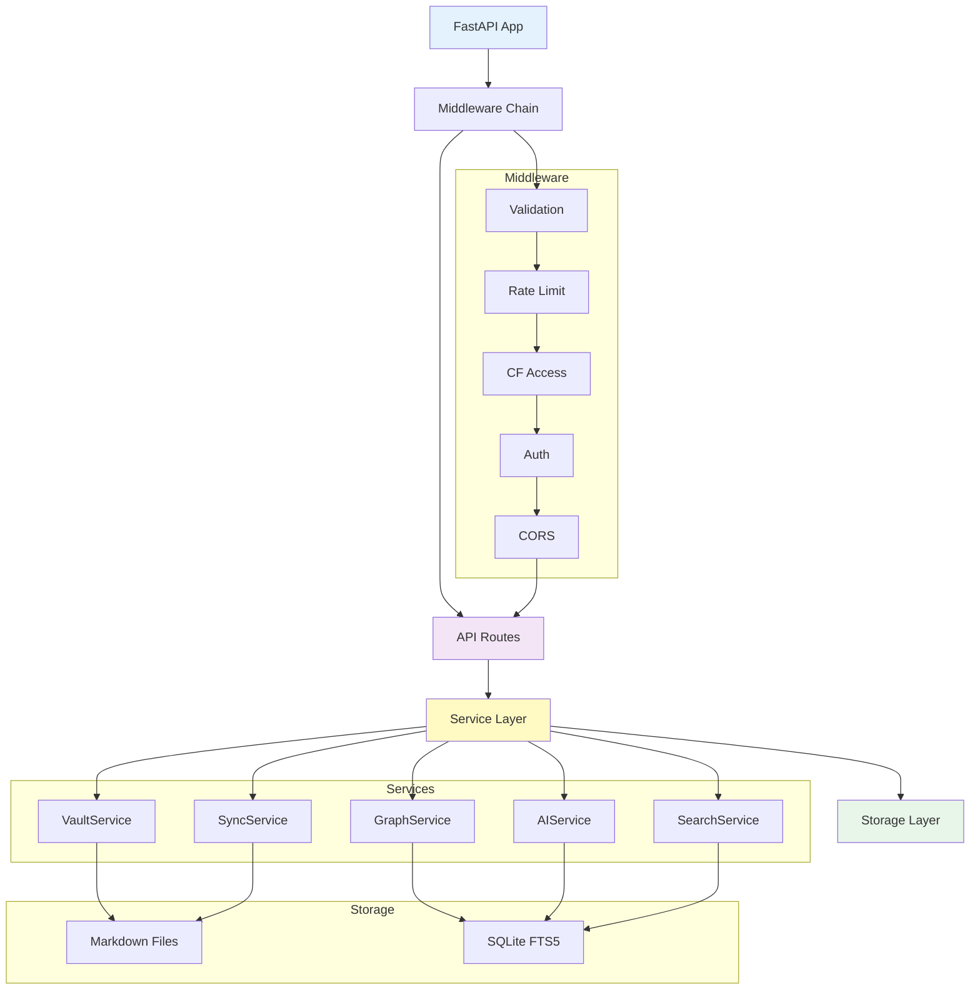

## Data Flow: Write Operation

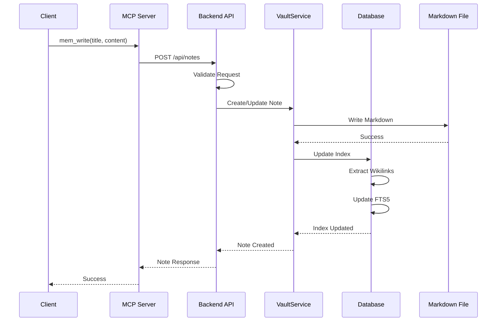

## Data Flow: Search Operation

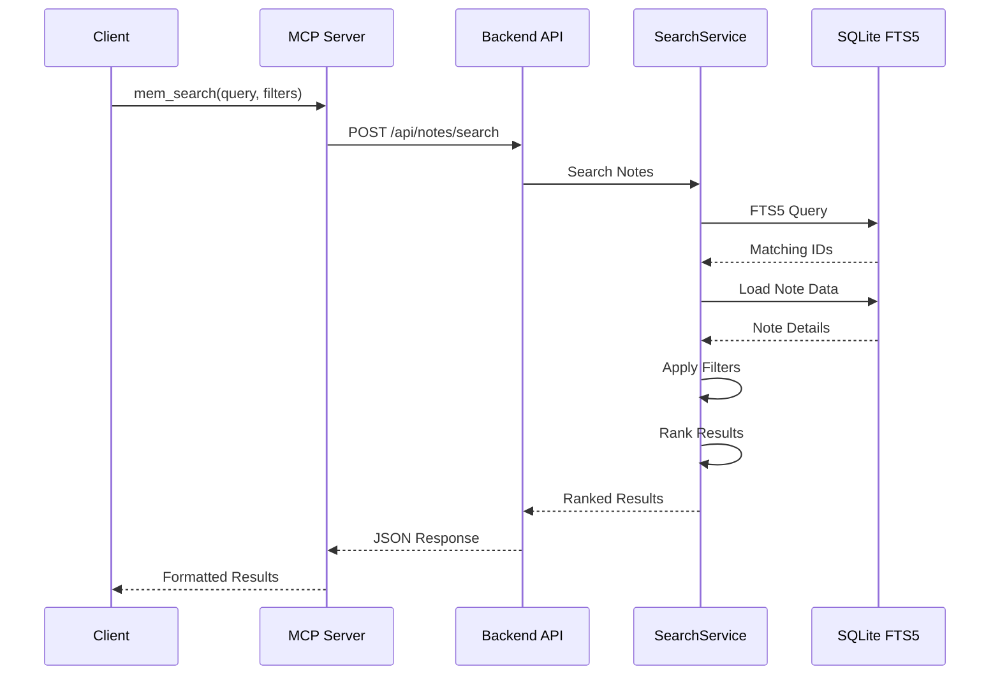

## Data Flow: Graph Traversal

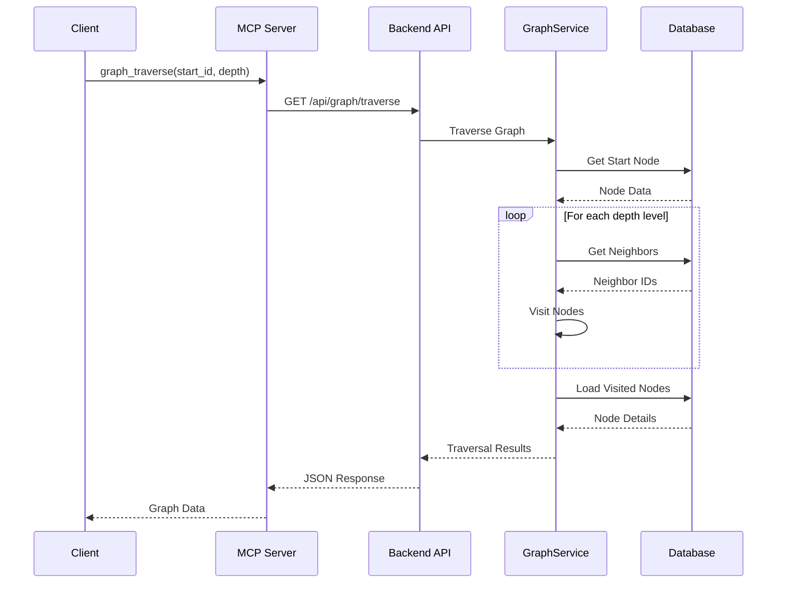

## Knowledge Graph Structure

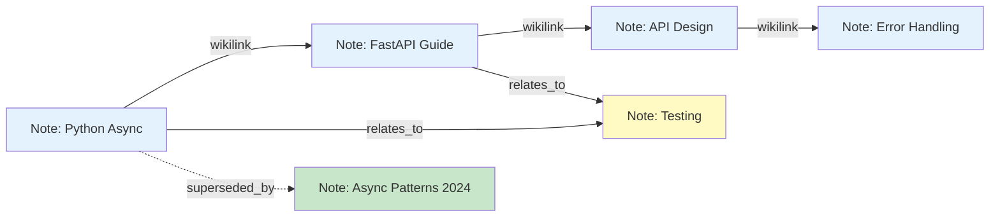

## Deployment Architecture (Production)

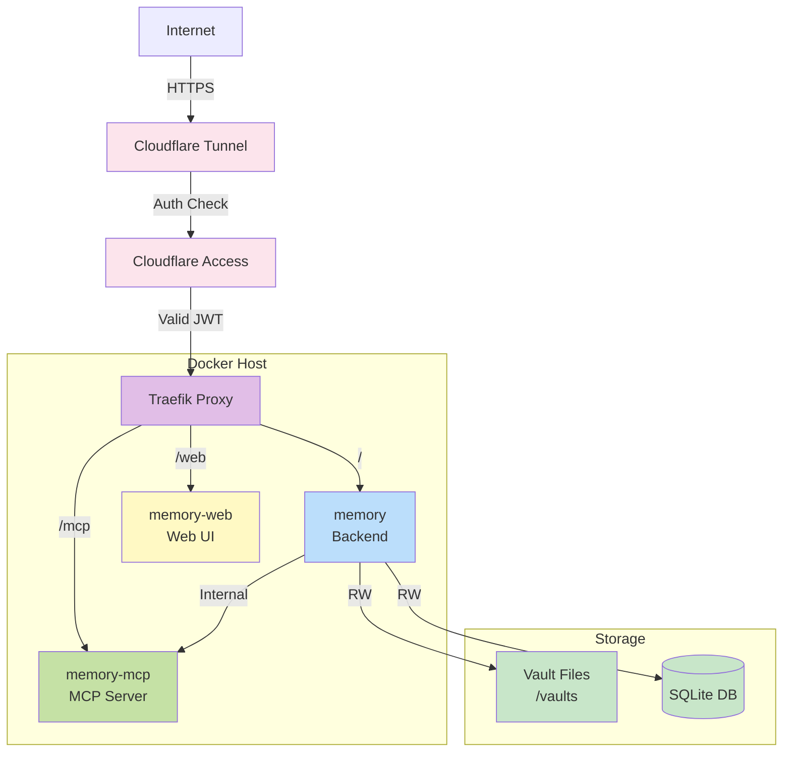

## Session Tracking Flow

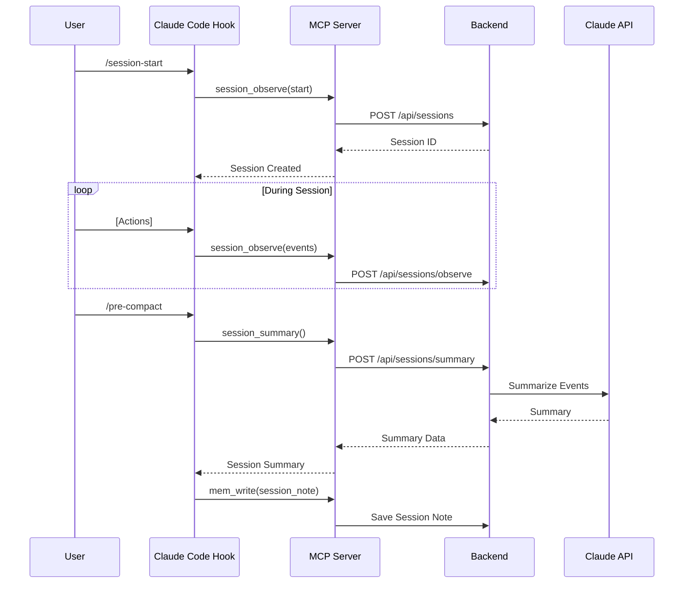

## Middleware Chain Flow

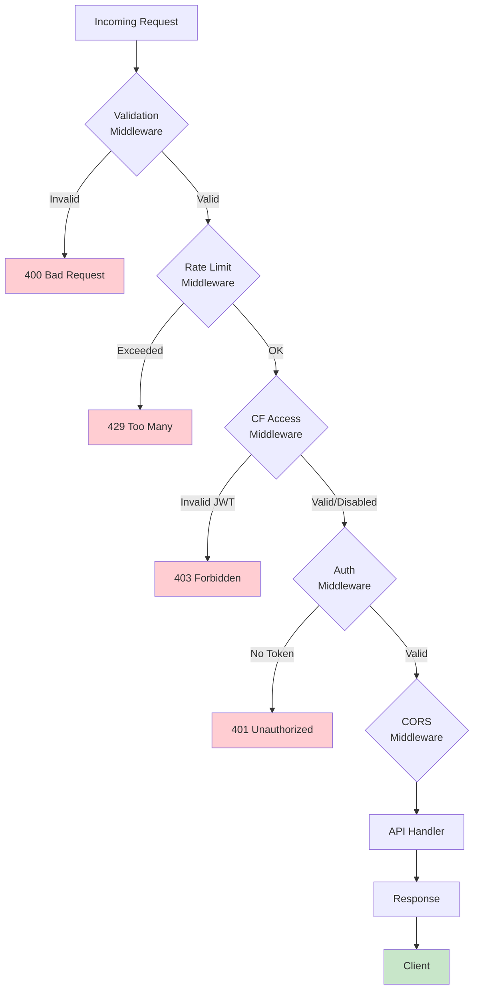

## File Storage Structure

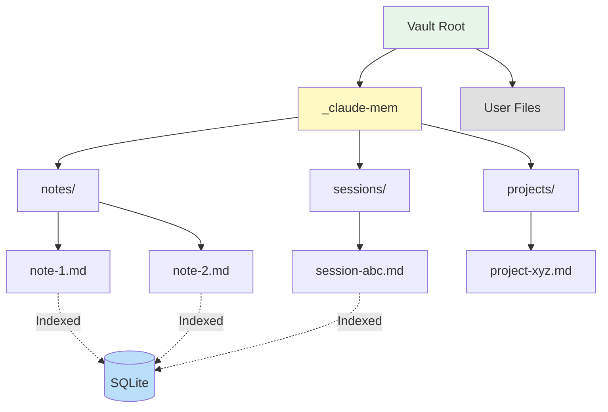

## AI Processing Pipeline

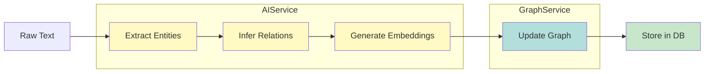

## Related Documentation

- [Architecture Guide](../ARCHITECTURE.md)
- [MCP Integration](../mcp-integration.md)
- [API Documentation](../api.md)
- [Deployment Guide](../deployment.md)
